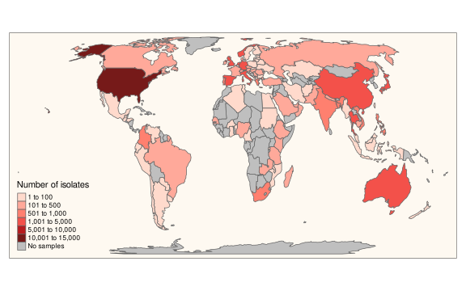
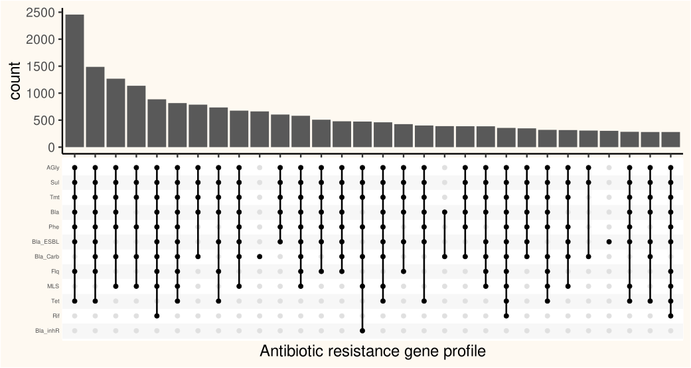
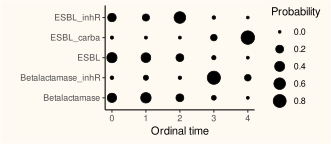

# Predicting antimicrobial resistance with hypercubic inference

This repository contains the complete pipeline for my poster at the Norwegian Bioinformatics Days. To generate all the plots run `Rscript run_all.R` from the root repository directory. The plotting code depends on `ggplot2`, `ggupset`, `tidyverse`, `plyr` and `tmap`. All of these dependencies are required for each plot. 

To run the model you must also to clone the [hypertraps-ct](https://github.com/StochasticBiology/hypertraps-ct) repository, and have `Rcpp`, `ape` and `phangorn` installed. Hypertraps-ct should be in a neighbouring folder to this repository on you computer. Alternatively you can change the hypertraps.path parameter in run\_hypertraps.R. Uncomment `model.fit <- run.hypertraps()` in run\_all.R and remove the line loading the precalculated data. Running the model should take less than 20 minutes.

All data, apart from the newick-trees, is downloaded from [pathogen.watch](pathogen.watch) with the download\_pathogenwatch.R script. 

## World map

The world map was made using tmap and populated with data from pathogen.watch. A function to make the plot can be found in scripts/world\_map.R.

## Upset plot

The upset plot was made using ggupset. The code can be found in scripts/upset.R

## Hypercube illustration

I made this illustration using Pinta and LibreOffice Impress on Ubuntu.

## Predicted ordered acquisition

To generate this plot we need a fitted model from HyperTraPS. One instance of this has been saved in fitted-model.Rdata. Further models can be made using run\_hypertraps(country\_name, your\_seed). Check the trees directory for avaible countries. The fitted model is plotted using the scripts/bubbles.R script. 

